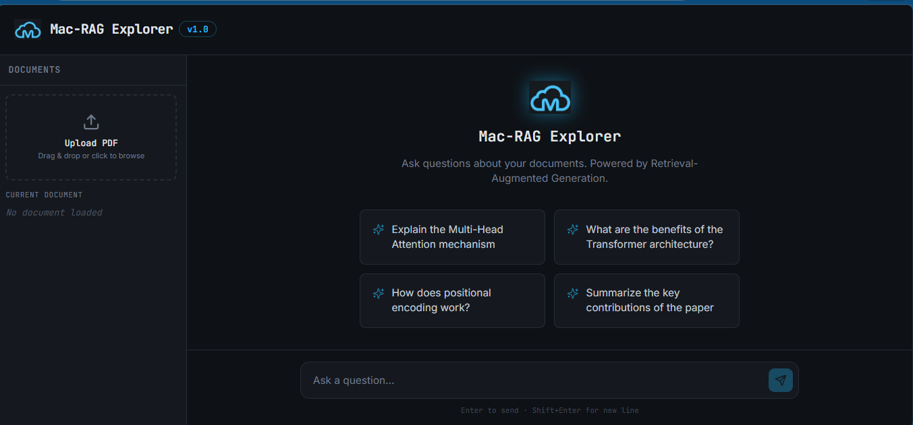
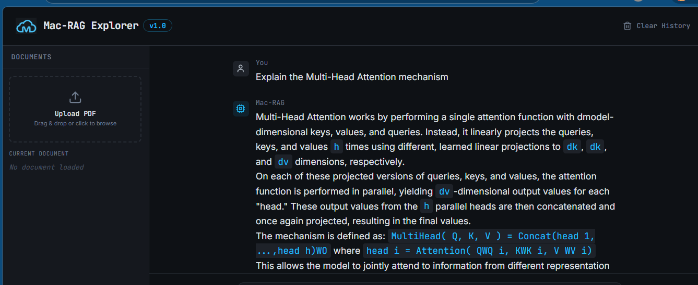
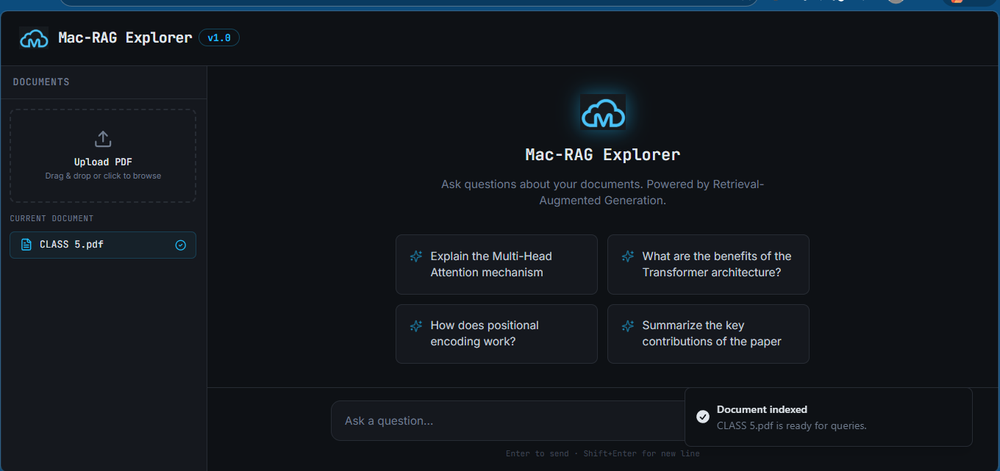
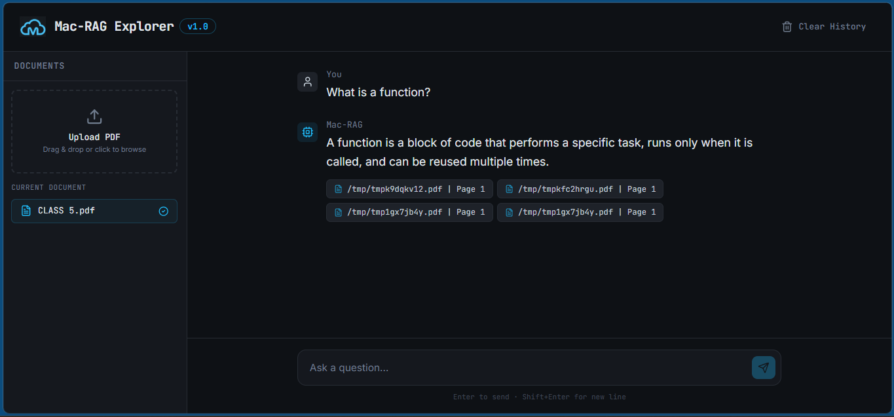
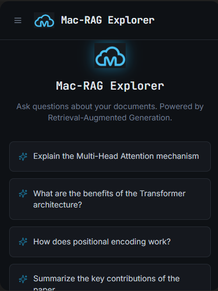

# Mac-RAG Explorer — RAG Document Q&A

A full-stack Retrieval-Augmented Generation (RAG) application that lets you upload any PDF and ask questions about it. Powered by Google Gemini, LangChain, and ChromaDB. Pre-loaded with the landmark "Attention Is All You Need" paper (Vaswani et al., 2017).

**Live Demo:** [mac-rag-explorer.vercel.app](https://mac-rag-explorer.vercel.app)
**Backend API:** [rag-document-qa-01m0.onrender.com](https://rag-document-qa-01m0.onrender.com/docs)

---

## Screenshots

### Welcome Screen


### AI Answer with Markdown Rendering


### PDF Upload — Document Indexed


### Querying a Custom Uploaded Document


### Mobile View


---

## Features

- Upload any PDF and ask questions about its content
- Pre-loaded with the "Attention Is All You Need" paper as the default knowledge base
- Retrieval-Augmented Generation — answers grounded in document content, not hallucinated
- Source cards showing exactly which pages the answer came from
- Markdown rendering for clean, formatted responses including code blocks
- Suggested prompts on empty state for quick exploration
- Clear History button to reset the conversation
- Auto-ingestion on startup — no manual setup required
- Fully responsive — works on mobile and desktop

---

## Tech Stack

| Layer | Technology |
|-------|------------|
| Frontend | React, TypeScript, Tailwind CSS, shadcn/ui, Vite |
| Backend | FastAPI, Python 3.11 |
| LLM | Google Gemini 2.5 Flash |
| Embeddings | Google Gemini Embedding 001 |
| Vector Database | ChromaDB (persistent, local) |
| RAG Framework | LangChain |
| Frontend Hosting | Vercel |
| Backend Hosting | Render |

---

## Architecture

```
User uploads PDF
      ↓
POST /upload → FastAPI → chunk + embed → ChromaDB

User asks question
      ↓
POST /ask → embed question → similarity search ChromaDB
      ↓
Top 4 relevant chunks → Gemini 2.5 Flash → answer + sources
      ↓
React Frontend renders markdown response with source cards
```

---

## API Endpoints

| Method | Endpoint | Description |
|--------|----------|-------------|
| `GET` | `/` | Health check |
| `POST` | `/ask` | Ask a question about the loaded documents |
| `POST` | `/upload` | Upload a new PDF to the knowledge base |

### POST /ask

**Request:**
```json
{
  "question": "What is the attention mechanism?"
}
```

**Response:**
```json
{
  "question": "What is the attention mechanism?",
  "answer": "An attention function maps a query and a set of key-value pairs...",
  "sources": [
    { "source": "attention.pdf", "page": 2 }
  ]
}
```

### POST /upload

**Request:** Multipart form data with a PDF file

**Response:**
```json
{
  "message": "Successfully processed document.pdf",
  "chunks": 47,
  "pages": 12
}
```

---

## Running Locally

### Backend

```bash
git clone https://github.com/merezki-11/rag-document-qa.git
cd rag-document-qa
pip install -r requirements.txt
```

Create a `.env` file:
```
GOOGLE_API_KEY=your_gemini_api_key_here
```

Start the server:
```bash
uvicorn main:app --reload
```

API runs at `http://127.0.0.1:8000`
Interactive docs at `http://127.0.0.1:8000/docs`

### Frontend

The frontend lives in a separate repo: [mac-rag-explorer](https://github.com/merezki-11/mac-rag-explorer)

---

## Project Structure

```
rag-document-qa/
│
├── main.py              # FastAPI app — all endpoints, RAG chain, auto-ingest
├── ingest.py            # Standalone ingestion script
├── attention.pdf        # Default knowledge base document
├── chroma_db/           # Persistent vector store (auto-populated on startup)
├── requirements.txt     # Pinned Python dependencies
├── .python-version      # Pins Python 3.11 for Render
├── .gitignore
├── images/              # App screenshots
└── README.md
```

---

## Key Technical Decisions

- **ChromaDB 0.4.24 + NumPy 1.26.4** — pinned for compatibility with Python 3.11 on Render
- **Auto-ingestion on startup** — `attention.pdf` is automatically chunked and embedded on first boot if ChromaDB is empty, so no manual setup is needed on the server
- **chunk_size=1000, chunk_overlap=200** — standard RAG configuration that balances context preservation and retrieval precision
- **k=4 retrieved chunks** — returns the 4 most semantically similar chunks per query

---

## Related Projects

- [gemini-cli-chatbot](https://github.com/merezki-11/gemini-cli-chatbot) — Phase 1: Gemini CLI chatbot
- [gemini-web-chatbot](https://github.com/merezki-11/gemini-web-chatbot) — Phase 1: Full-stack AI tutor web app
- [mac-rag-explorer](https://github.com/merezki-11/mac-rag-explorer) — Phase 2: Frontend repo

---

## Author

**Macnelson Chibuike**
- GitHub: [@merezki-11](https://github.com/merezki-11)
- LinkedIn: [Macnelson Chibuike](https://www.linkedin.com/in/macnelson-chibuike)

---

## License

This project is open source and available under the [MIT License](LICENSE).
